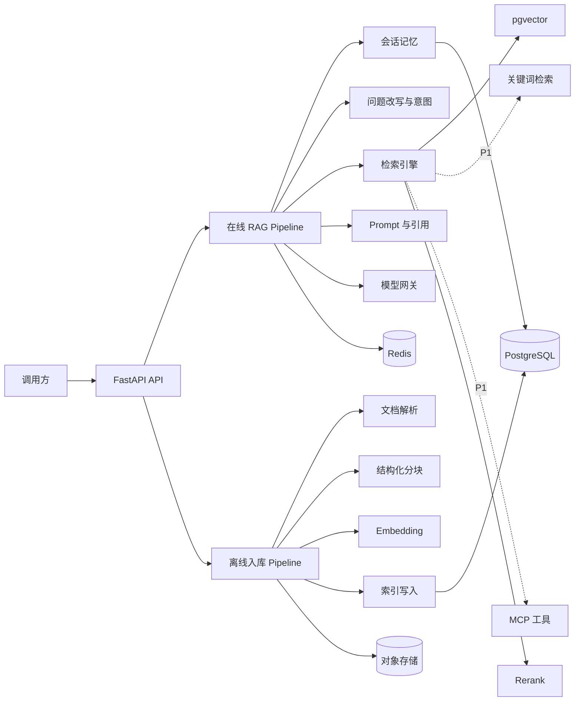
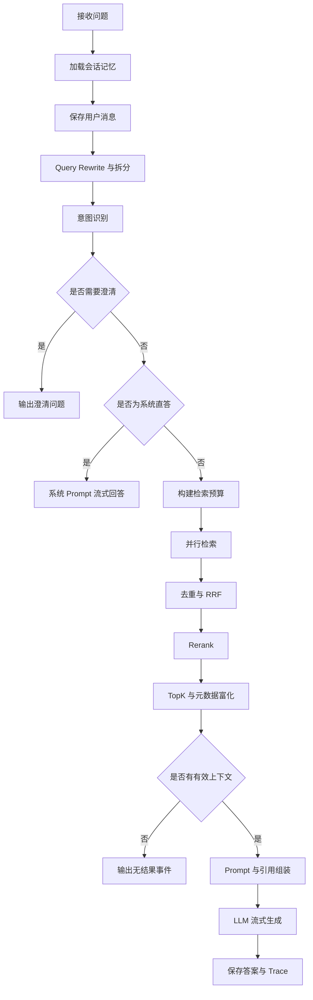

# Customer Agent 2 系统架构

## 1. 架构目标

系统架构围绕四个目标设计：

1. **显式可解释**：主链路可以逐阶段调试，不把关键行为隐藏在黑盒框架中。
2. **可替换**：模型、向量库、解析器和检索通道通过接口替换。
3. **可降级**：外部模型、Rerank 或单个检索通道失败时有明确行为。
4. **可评测**：每个阶段产生结构化输入、输出和耗时，支持固定数据集比较。

## 2. 系统边界

Customer Agent 2 负责：

- 知识文档摄取与索引。
- 问题理解、检索、重排序和答案生成。
- 会话记忆、引用溯源、流式事件和最小 Trace。
- 面向客户端的 HTTP API。
- 面向评测器的稳定接口。

系统不负责完整商城、订单数据库、支付、用户中心和管理后台。P1 的 MCP 订单/物流工具默认使用独立 Mock 数据或明确授权的外部接口。

## 3. 总体结构



## 4. 分层设计

规划中的 Python 包结构如下：

```text
src/customer_agent2/
├── api/               # HTTP 路由、请求响应、SSE 适配
├── application/       # 用例和 Pipeline 编排
├── domain/            # 领域模型、接口、规则和纯算法
├── infrastructure/    # 模型、数据库、Redis、存储和外部服务适配
├── evaluation/        # 评测数据、指标和运行器适配
├── config/            # Pydantic Settings 与启动校验
└── main.py            # 应用入口
```

依赖方向：

```text
api → application → domain
infrastructure → domain
application 通过 domain 接口使用 infrastructure
```

`domain` 不依赖 FastAPI、SQLAlchemy、Redis SDK 或具体模型供应商。

## 5. 在线 RAG Pipeline

### 5.1 主流程



### 5.2 Pipeline 上下文

完整 P0 Pipeline 使用一个有类型的 `ChatPipelineContext` 在阶段间传递状态，最终至少包含：

- request_id、conversation_id、user_id。
- original_question、rewritten_question、sub_questions。
- memory_messages、summary。
- intent_candidates、guidance_decision。
- retrieval_budget、channel_results、ranked_chunks。
- prompt_messages、sources。
- cancellation_scope、trace。

阶段不得通过全局变量共享请求状态。

M3-A 先落地请求身份与显式检索范围、原问题/当前改写问题、子问题、记忆占位、向量通道结果、
TopK Chunk、Prompt 消息、编号来源和阶段 Trace。M4-A 已用类型化字段填充可选摘要和最近
completed 消息；当前仍为 `rewritten_question == original_question`。Intent 和 Guidance 字段在
对应 M4 后续子阶段加入，不用无约束字典提前占位。

M3-B 的 API 适配器只负责把已实现的内部事件映射到 ADR-0005 SSE Schema。它生成请求 ID，
但不把 FastAPI Request、StreamingResponse 或无类型字典放入 Pipeline 上下文。

M3-C 使用 `PersistentStreamingRagPipeline` 装饰基础 Pipeline。装饰器只依赖领域仓储端口，
在内层开始前提交 user 消息与 running Run，在成功 done 前提交终局；基础 Pipeline 仍不知道
SQLAlchemy。

M4-A 的默认组合顺序是
`Summarizing(Persistent(MemoryAware(Basic)))`：Persistent 先保存当前 user；MemoryAware 只加载
此前 completed 消息，因此不会重复当前问题；Persistent 在 completed done 前保存回答；最外层
Summarizing 随后把滑出最近 6 轮窗口的完整轮次增量摘要。摘要失败只记录降级，不改变成功 done。

### 5.3 短路语义

以下情况允许提前结束 Pipeline：

- 意图歧义，需要用户补充信息。
- 系统闲聊或无需知识库的直接回答。
- 检索为空，且策略不允许无依据生成。
- 客户端断开、全局超时或主动取消。
- 所有模型候选不可用。

短路必须产生明确 SSE 事件和 Trace 结局，不能表现为无响应。

M3-A 已实现空检索 `no_context` 短路：只产生内部状态和完成事件，不调用 Chat 模型。检索、
Prompt 和生成阶段记录不含文档正文的轻量 Trace。单一截止时间覆盖检索和逐个模型流读取；
超时、任务取消或上游提前关闭时，Pipeline 在 `finally` 中关闭模型异步生成器。

M3-B 已将空检索映射为明确的 no_context status + done。流开始后的 Pipeline、检索或模型失败
映射为 error + done；客户端断开不伪造无法送达的终端事件，取消继续向下传播并逐层关闭
Pipeline、模型流和供应商 HTTP 响应。

M3-C 会把已开始但未完成的取消标记为 cancelled；检索/模型/协议失败标记为 failed；空检索
标记为 no_context 且不创建 assistant 消息。completed 只有在 assistant 消息与 Run 终局事务
提交后才向客户端发送 done。

## 6. 检索架构

### 6.1 检索通道接口

每个 `SearchChannel` 接收统一 `SearchContext`，返回：

- 通道类型和名称。
- 候选 Chunk 列表。
- 原始排名和分数。
- 延迟、错误与降级元数据。

P0 只实现 Vector Channel；P1 增加 Keyword Channel。Graph、Web Search 仅保留扩展点。

### 6.2 三段检索预算

检索参数分为：

1. `recall_budget`：每个通道最多召回多少条。
2. `rerank_candidate_limit`：融合后送入 Rerank 的候选上限。
3. `context_top_k`：最终进入 LLM 上下文的条数。

启动时校验：

```text
recall_budget >= context_top_k
rerank_candidate_limit >= context_top_k
```

如果启用多个通道，后处理顺序固定为：

```text
合并 → 去重 → 加权 RRF → 候选截断 → Rerank → TopK → 元数据富化
```

### 6.3 向量检索作用域

- 高置信知识库意图：只在意图绑定的知识库中检索。
- 无意图或低置信：允许在权限层解析出的全部可访问知识库中检索兜底。
- 检索过滤必须在数据库查询侧完成，不能只在返回结果后过滤。
- M2-G 的 `VectorSearchScope` 要求非空知识库 ID 列表，不提供隐式“查询所有知识库”开关；
  未来全局兜底也必须由上游传入明确授权后的知识库集合。
- 文档 ID、文档格式、解析器、章节和页码使用类型化过滤条件，全部进入 SQL `WHERE`。
- 查询前校验范围内每个知识库的 model ID、revision、维度和归一化；检索只连接 `active`
  文档版本，配置不一致或知识库不存在时返回稳定的脱敏错误。
- 带过滤的 HNSW Cosine 查询在事务内设置 `hnsw.iterative_scan=strict_order` 和可配置
  `hnsw.ef_search`，缓解近似索引先扫描后过滤造成的候选不足，并避免设置泄漏到连接池。

## 7. 文档入库 Pipeline

固定主骨架：

```text
Identify → Parse → Chunk → Embed → Index
```

### 7.1 Identify

- M2-F 已对 Markdown/TXT/CSV 实现扩展名、MIME 和 UTF-8 内容校验；这些纯文本格式没有
  稳定文件签名。
- PDF 必须具有 `%PDF-` 文件头；DOCX 必须是包含必要 Office Open XML 成员的安全 ZIP。
- 已拒绝空文件、不支持类型、超过可配置 50 MiB 上限、类型冲突、伪造签名、二进制控制字符、
  加密 PDF、宏 DOCX 和超过资源限制的压缩包。

### 7.2 Parse

- M2-F 已实现五种 P0 格式：Markdown/TXT 保持原有结构；PDF 使用 pypdf 按页提取；DOCX
  使用 python-docx 按正文顺序保留标题、段落、列表与表格；CSV 为每条记录重复表头。
- 五种格式统一输出 `ParsedDocument`，继续进入相同 Chunk、Embedding 和 Index 主链路。
- 扫描件 OCR、复杂图片、旧版 Office 和 XLSX 在 P1 处理。

### 7.3 Chunk

- M2-C 已确认目标 400 Token、Overlap 64 Token，并校验目标不超过 Embedding 的 512 Token 上限。
- 已实现结构优先分组：标题开启新组，同章节的段落、列表项和代码块在预算内合并，
  不跨标题章节合并。
- 结构块或结构组超预算时，使用与 Embedding 相同 model ID/revision 的真实 Tokenizer
  执行滑窗切分；64 Token Overlap 只用于这种二次切分，自然结构边界不强制重叠。
- Chunk 草稿携带 chunk_index、Token 数、内容哈希、章节路径、Block 范围、来源行号
  和实际 Overlap。M2-D 入库适配器将这些字段写入类型化列和 JSONB 来源元数据。

### 7.4 Embed 与 Index

- M2-D 已实现显式 `Parse → Chunk → Embed → Index` 应用用例。Parse/Chunk 在工作线程执行，
  Embedding 使用一个批量请求交给适配器的 CPU Batch。
- 分词器、Embedding 返回结果和知识库保存的 model ID、revision、维度、归一化必须一致。
- Parse/Chunk 成功后以短事务创建 `building` 版本；模型计算期间不持有数据库事务。
- 全部向量就绪后，单个激活事务写入 Chunk、将旧 active 改为 `superseded`、将新版本改为
  `active`。中途失败时整个激活事务回滚，旧 active 保持不变，新版本最终标记为 `failed`。
- 并发创建版本时短暂锁定知识库行，避免同一文档出现重复版本号或逻辑文档竞态。

### 7.5 最小入库 API

- M2-E 在 `/api/v1` 下实现知识库创建、multipart 文档上传、文档状态查询和作用域内删除。
- 上传是同步契约：只有新版本 active 后才返回 201，不生成虚假的后台任务 ID。
- API 最多有界读取 `UPLOAD_MAX_FILE_MB + 1 byte`，并在成功、失败或取消后关闭上传文件对象。
- lifespan 在连接池打开后构建一次共享服务图，Tokenizer 和 Embedding 仍按首次上传懒加载。
- 错误响应只包含稳定 code、公开 message 和 retryable，详细契约见
  [ADR-0003](adr/0003-minimal-ingestion-api.md)。

## 8. 模型网关

模型网关对应用层暴露：

- `ChatModel`：同步或流式生成。
- `EmbeddingModel`：批量向量化。
- `RerankModel`：查询与候选文档重排序。
- `VisionModel`：P1 图片理解。

供应商适配器负责协议差异，应用层只依赖统一请求和结果模型。

模型失败策略：

- 最终模型额度不足：返回可识别错误，支持修改模型 ID 后重试。
- 快速模型失败：可按配置降级到最终模型，但记录额外成本与延迟。
- Rerank 失败：显式 No-op 降级，保留融合排名。
- 流式首包超时：取消当前请求，再决定是否切换候选模型。
- 已经向客户端输出正文后，不自动切换模型重放答案，避免重复内容。

## 9. SSE 事件协议

P0 事件类型：

| 事件 | 作用 |
|---|---|
| `status` | 当前阶段；现有 retrieving、prompting、generating、completed、no_context |
| `reply_to` | 当前会话、对应 user 消息和 RAG Run ID |
| `content` | 正文增量 |
| `sources` | 最终引用来源 |
| `guidance` | 需要用户澄清的信息（M4 加入） |
| `error` | 结构化错误码和可公开信息 |
| `done` | 完成结局、阶段 Trace 和可选模型用量 |

M3-B 已在 `POST /api/v1/chat/stream` 实现 status、content、sources、error 和 done，M3-C
增加 reply_to 和可选 `conversation_id`。每个事件包含请求 UUID 和严格递增序号；HTTP 200
只表示流已建立，最终结果以 done.outcome 为准。
完整 JSON 字段、事件顺序、HTTP 错误边界和断开语义由 [ADR-0005](adr/0005-streaming-rag-api.md)
与 [ADR-0006](adr/0006-conversation-rag-run-persistence.md) 维护，修改必须更新 ADR 或增加 API
版本。

## 10. 数据存储

### PostgreSQL/pgvector

M2-A 已实现：

- knowledge_bases
- documents
- document_versions
- chunks（包含 embedding）

这四张表采用版本隔离、单一 active 版本和固定 768 维 Cosine HNSW 索引，详细决策见
[ADR-0002](adr/0002-document-index-schema.md)。M2-F 已实现五种 P0 格式的事务化入库与最小 HTTP API；
M2-G 已实现复用同一 Embedding 实例的内部向量召回服务、active-only 查询、索引配置校验和
数据库侧作用域过滤。M3-B 已在显式知识库作用域上提供公开流式问答 API。

M3-C 已实现：

- conversations
- messages
- rag_runs（内含当前阶段的轻量 JSONB Trace 与引用 Chunk ID）

M4-A 已实现 `conversation_summaries`：每个会话一条最新摘要、覆盖边界、累计来源消息数和 fast
模型 ID。是否拆分 `rag_trace_nodes` 等评测查询证明需要后再决定。

### Redis

规划用于：

- 限流和并发许可。
- 短期任务状态与取消信号。
- 可选的会话热数据缓存。
- P1 后台任务队列或 Pub/Sub 通知。

Redis 不是消息和知识数据的唯一事实来源。

### 对象存储

M2-E 不持久化原始文档，只在请求期间使用框架管理的 multipart 临时 spool。后续原始文档和
解析资产规划使用 S3-compatible `ObjectStorage` 接口；当前尚未引入 MinIO。

## 11. 配置和启动校验

应用启动时至少校验：

- 必需模型配置与 API Key 是否存在。
- RAG 全局截止时间不得小于单次模型请求总超时。
- Embedding 维度和索引维度是否一致。
- 检索漏斗预算是否合法。
- 最近记忆为 6 轮，摘要触发轮数 12 必须大于最近窗口，摘要输出与超时必须为正数。
- PostgreSQL、pgvector 和 Redis 是否可连接。
- 启用 Rerank 时 Workspace ID 是否配置。
- 启用 VLM/MCP 时相应端点是否配置。

配置错误应快速失败，不允许静默使用未知默认值。

## 12. 安全边界

- 上传文件限制大小、类型和解析超时。
- 文档内容视为不可信输入，Prompt 中明确区分资料和系统指令。
- M3-A 使用固定 `<knowledge_context>` 边界并转义问题、文档正文和来源属性；模型 reasoning
  增量不会进入对上游暴露的答案正文事件。
- M3-B 的来源事件不包含正文；未知流异常只返回通用错误，不公开异常文本或堆栈。
- M3-C 不保存 reasoning、Prompt、完整召回正文或底层异常；failed/cancelled 只保存稳定错误码。
- M4-A 把历史与摘要放入转义后的 `<conversation_memory>` 不可信数据边界；历史只能解析指代，
  回答事实仍必须由 `<knowledge_context>` 支撑。
- MCP 工具使用 Allowlist；P1 默认只实现只读工具。
- 错误响应不暴露密钥、数据库 DSN、堆栈和完整文档内容。
- 日志中的问题和文档片段应支持截断或关闭。

## 13. 可观测与评测

每次 RAG Run 至少记录：

- 模型 ID 与配置档位。
- Rewrite、Intent、Retrieval、Rerank、Generation 的阶段耗时。
- 各通道候选数量和最终 TopK。
- 降级、超时、取消和错误类型。
- 引用文档 ID，不默认保存完整上下文。

M3-C 已记录当前实际存在的 Retrieval、Prompting、Generation Trace、最终来源 Chunk、模型结果、
Token 用量和终局。Rewrite、Intent、Rerank 与降级字段必须等对应阶段实现后再写入，不能伪造。
M4-A 摘要失败使用不含消息正文和异常文本的结构化 `conversation_summary_degraded` 告警；摘要
目前不伪装成公开 Pipeline Trace 阶段。

评测器通过稳定 API 获取意图、来源、延迟和回答，避免从日志文本反向解析。
